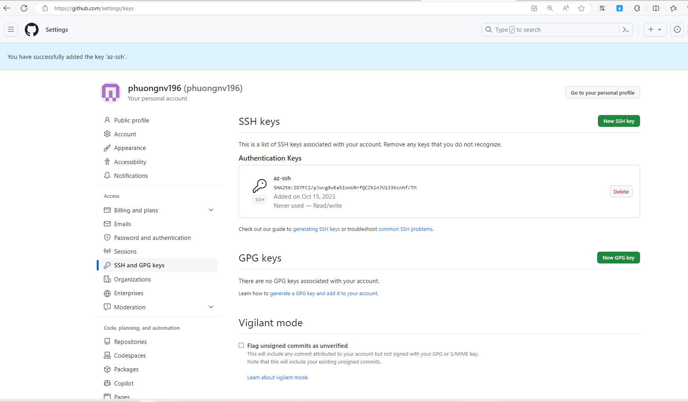

## Overview

In this project, We will build a Github repository from scratch and create a scaffolding in performing both Continuous Integration and Continuous Delivery.
- Using Github Actions along with a Makefile, requirements.txt and application code to perform an initial lint, test, and install cycle.
- Integrating this project with Azure Pipelines to enable Continuous Delivery to Azure App Service.
- Using Azure Cloud shell in this project.

## Project Plan

- [Trello Board](https://trello.com/b/umdJDZJw/udacity-project-2)
- [Original Project Plan](documents/OriginalProjectPlan.xlsx)
- [Final Project Plan](documents/FinalProjectPlan.xlsx)

## Architecture Diagram

[Architectural Diagram](screenshots/architecture.png)

## Instructions
### Configuring Github

- Log in Azure Portal and access Azure Cloud Shell

- Create a ssh key by using this command:

    ```bash
    ssh-keygen -t rsa -b 2048 -C "phuongnv1996@outlook.com"
    ```

    

- Copy the public key to Github Account -> Settings -> SSH and GPG keys (https://github.com/settings/keys)

    


### Project Locally

- After setting SSH key in Github, we can clone source code to Azure Cloud Shell by using command below: 

    ```bash
    git clone git@github.com:phuongnv196/udacity-project-2.git
    ```

    

- Create a Python Virtual Environment to run your application

    ```bash
    python3 -m venv ~/.udacity-project-2
    source ~/.udacity-project-2/bin/activate
  ```
    
                                  

- Install all dependencies by using **make**
    ```bash
    make all
    ```

    

- Run application using **flask**
    ```bash
    export FLASK_APP=app.py
    flask run
    ```
    
                                                                     

- After run application we had to open new tab and lauch a new Azure Cloud Shell session to test the application by running the *make_prediction.sh* script
    ```bash
    chmod +x make_prediction.sh
    ```
    ```bash
    ./make_prediction.sh
    ```                               

    We can see the result of script: 
    ```bash
    Port: 5000
    {"prediction":[20.353731771344123]}
    ```      

      

### Azure App Service

Azure App Service is a cloud platform service (PaaS) offered by Azure that allows you to easily and quickly deploy web applications, mobile back-ends and RESTful APIs without worrying about the infrastructure. Some of the benefits of using Azure App Service are:

- It supports multiple programming languages (Java, Python, C#) and frameworks (.NET, Spring boot, Flask), giving you the flexibility to choose the best tools for your project.
- It provides high availability and scalability, ensuring that your applications can handle high traffic and demand without downtime or performance issues.
- It supports both Windows and Linux operating systems, enabling you to run your applications on the platform of your choice.
- It integrates very well with Azure pipelines for continuous delivery, allowing you to automate the deployment process and deliver updates faster and more reliably.
For more information and tutorials on how to use Azure App Service, please visit this [link](https://docs.microsoft.com/en-us/azure/app-service/).


#### ML Azure App Service
Azure App Service provides various options to create a new application. In this section, you will learn how to use the Azure CLI to deploy your app. In another section, you will see how to use Azure Pipelines to automate the deployment process.                                          
**Set up Azure CLI:**

- Create a new Resource Group for our app

   ```bash
    az group create --location westeurope --resource-group phuongnv_rg_02 --tags project=udacity_p_2 environment=dev
    ```                                                                                                                                                                                                                              
**Deploy Application:**

- Clone the project, we can clone source code to Azure Cloud Shell by using command below: 
    ```bash
    git clone git@github.com:phuongnv196/udacity-project-2.git
    ```
- Create a Python Virtual Environment to run your application

    ```bash
    python3 -m venv ~/.udacity-project-2
    source ~/.udacity-project-2/bin/activate
  ```
    
                                  

- Install all dependencies by using **make**
    ```bash
    make all
    ```

    

- Deploy application into the our resource group

    ```bash
    az webapp up -n flask-app-phuongnv --resource-group phuongnv_rg_02 --sku FREE
    ```

- Application will be deployed to azure service
  **(https://${app-name}.azurewebsites.net)** default port is 443

  
  
 - We can find app service in Azure Portal
  
  
  - Application was deployed successfully using azure pipelines from Deployment Center
  

**Test ML Application:**

- Modify the *'make_predict_azure_app.sh'* script by updating the host name to align with the prediction application that has been deployed.


- Run the script *'make_predict_azure_app.sh'* to test the app

    ```bash
    chmod +x make_predict_azure_app.sh

    ./make_predict_azure_app.sh
    ```
- We will get the result: 

    ```
    Port: 443
    {"prediction":[20.353731771344123]}
    ```
    
    

- Run locust from project folder in Windows by using Windows Power Shell

    ```bash
    locust
    ```
  

- We can access to http://localhost:8089 to test application with *locust*

  

**Logs of Azure Webapp:**

Azure App Service offers the capability to access and view application logs. You can access these logs using Azure CLI commands:
    ```
    az webapp log tail --name flask-app-phuongnv --resource-group phuongnv_rg_02
    ```


### Github Actions

GitHub Actions is a powerful feature provided by GitHub, enabling the creation of comprehensive CI/CD workflows. Within the context of this project, we harness GitHub Actions to execute our Continuous Integration (CI) processes. These processes encompass building, linting, and testing our code, all of which are performed seamlessly through GitHub Actions.

To set up GitHub Actions for your repository, follow these steps:

1. Navigate to the "Actions" tab within your GitHub repository.

2. Select "New Workflow," and opt for the "Python Application Workflow." GitHub has the ability to analyze your code and suggest relevant workflows tailored to your codebase.


3. Proceed with the workflow setup process. GitHub Actions will configure a workflow that suits the requirements of your code.

4. Customization of the actions to align with our specific needs is essential. The default action steps are designed to run Python commands. However, given that we employ the *Make* utility for building, testing, and linting our code, we will need to adjust the GitHub Actions configuration accordingly.

By following these steps, you can harness the full potential of GitHub Actions and tailor them to your project's requirements.

